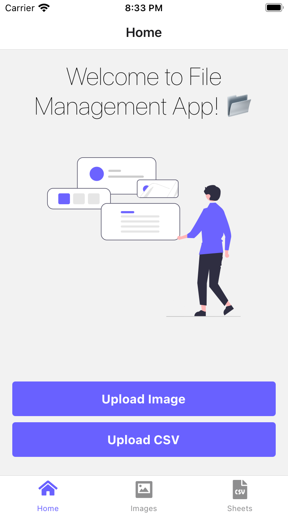
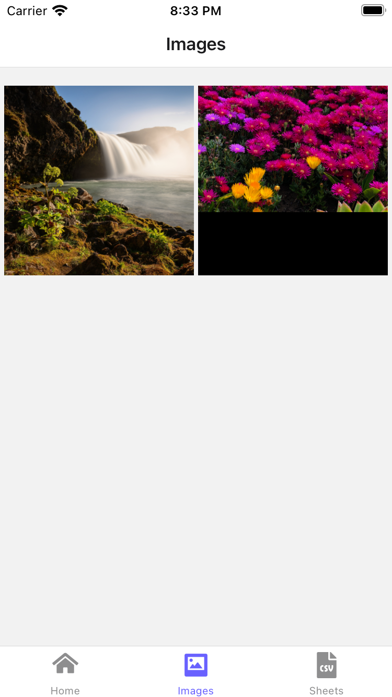
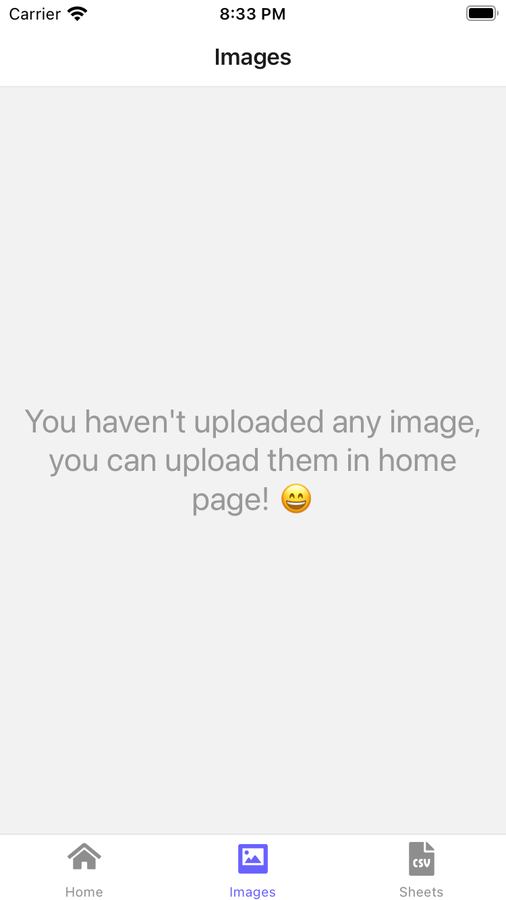
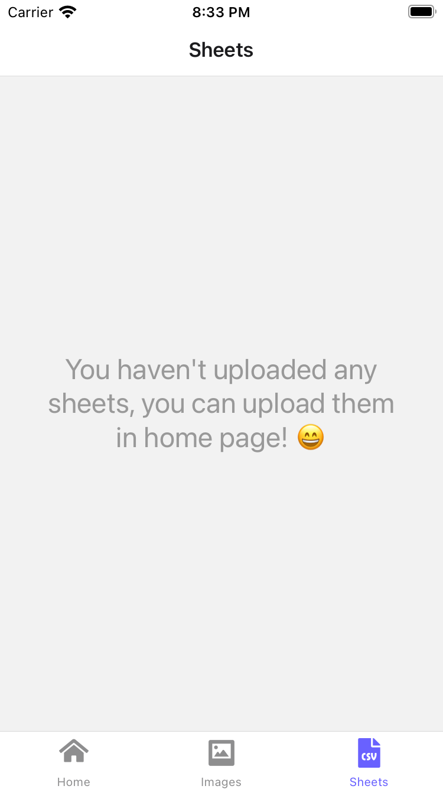

# About

Simple mobile application that showcases my skills when developing with React Native.

# Prerequisites

- Node v16+ installed
- A test device with 'Expo Go' installed

# How to run

First clone the git repository and on the root folder run:

```
npm install
```

Wait a moment until dependencies are done downloading. When completed run to start the metro dev server:

```
npm run start
```

Scan QR code from a device with Expo Go.

Enjoy!

# Screenshots

## Home Screen



## Images Screen





## Sheets Screen



**Disclaimer**: This was developed using an iPhone as a test device. For any issues regarding Android devices, please raise an issue.
